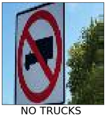
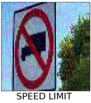
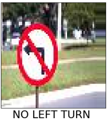
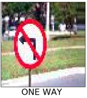
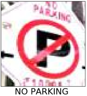
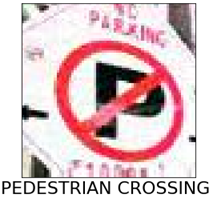

# Machine Learning Adversarial Image Generator 

This tool generates machine-learning inputs designed to cause image classifiers to make mistakes. 

| __Benign__ | __Adversarial__ |
|-------------|------------|
|          |      |
|          |  |
|          |  |

Based from the following papers: 

* [Explaining and Harnessing Adversarial Examples](https://arxiv.org/abs/1412.6572)
* [Practical Black-Box Attacks against Machine Learning](https://arxiv.org/abs/1602.02697)

## Pre-requesites

The following dependencies are required: 
* Tensorflow >= v1.8
* [Cleverhans](https://github.com/tensorflow/cleverhans) 

## End-to-end Attack

### Binaries 
* load_data.py
* train_model.py
* generate_adversarial_images.py

### Fetch data

```bash
$ todo: upload data to remote online repo
```

###  Generate training labels and features 

```bash
$ DATA_DIR=/tmp/data
$ python load_data.py \
    --dataset dataset \
    --output $DATA_DIR
```
Pre-processed data will be generated in `$DATA_DIR`

###  Train traffic sign classifier model

```bash
$ MODEL_DIR=model
$ MODEL_NAME=saved_model.h5
$ python train_model.py \
    --dataset $DATA_DIR
    --outout $MODEL_DIR
    --model-name $MODEL_NAME
```
Model will be generated in `$MODEL_DIR`

###  Generate the adverarial images

```bash
$ python generate_adversarial_images.py \
    --dataset $DATA_DIR
    --model-dir $MODEL_DIR
    --model-name $MODEL_NAME
```
Adversarial images will be generated under:
* `adv_imgs\adverarial` = adversarial images
* `adv_imgs\noise` = noise added to benign image
* `adv_imgs\reg` = the benign image

###  Evaluate the images
todo

## Bring Your Own Model
todo

## Defenses
todo

